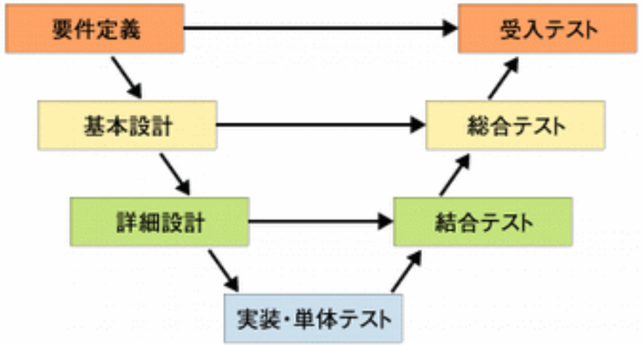
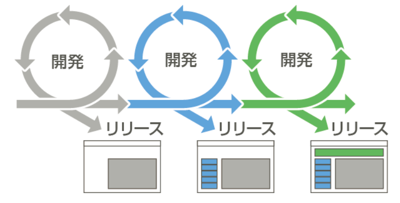

# The Basic Developping of Software

## "プログラミング"ができる人って何？  

「私プログラミングできるんですよー」  
***この人は本当にプログラムだけできるのか？***  

- 多くの"私プログラミングやってるんですよ人"は、単にプログラムが書けるだけではない。  

- この人たちの、「私プログラミングできるんですよー」は、「ソフトウェア開発ができるんですよー」を指す。  

 

## ソフトウェア開発の構成要素

### 要件定義  

どんなものを作るかを決める。

 

### 基本設計  

要件定義で作ると決めたものの、細かい動きや仕様を決める。

 

### 詳細設計

基本設計書で決めた動きや仕様を、プログラムでどう実現するかを決める。  

 

### 実装

詳細設計に従ってプログラミング。

 

### テスト  

作成したものがちゃんと動くかを確認する。  

 

#### 単体テスト  

プログラムの１行１行がちゃんと期待動作をしているかの確認。  

 

#### 結合テスト  

プログラムした部品どうしを繋げてちゃんと動くかを確認。
(プログラムを作成する際は、機能ごとに作成する場合が多く、結合テストではそれらの連携を確認する)  

 

#### 最終テスト(いろんな呼び方がある)  

実際に操作して、不具合を洗い出す。

 

## ソフトウェア開発プロセスの種類

 

### 最もオーソドックスなソフトウェア開発プロセス - ウォーターフォール開発  

ウォーターフォール開発は、従来的な開発手法。  
  

〇：従来型の開発プロセスで、開発の流れがつかみやすく、設計をしっかりすることでプログラミングの時間短縮になる。  
〇：大規模プロジェクト向きで、１度リリースしたソフトの修正を頻繁には行わないつもりのソフトウェアを開発するときには便利。  
✕：プロセスが多いため、ソフトウェアのリリースに時間がかかる。  
✕：実装時に仕様変更が発生した場合は、修正対応範囲が広くなる。  

 

### 最近はやりのアジャイル開発  

  

〇：全ての機能を実装してリリースするわけではないため、仕様変更に強い。  
〇：１リリースにかかる時間が短い。
✕：次から次へと機能をリリースするため、ミーティングや打合せの時間が増える。  
✕：ドキュメントを残さない事が多く、属人化しやすい。  

[参考図書](https://www.amazon.co.jp/%E3%81%9A%E3%81%A3%E3%81%A8%E5%8F%97%E3%81%91%E3%81%9F%E3%81%8B%E3%81%A3%E3%81%9F%E3%82%BD%E3%83%95%E3%83%88%E3%82%A6%E3%82%A7%E3%82%A2%E3%82%A8%E3%83%B3%E3%82%B8%E3%83%8B%E3%82%A2%E3%83%AA%E3%83%B3%E3%82%B0%E3%81%AE%E6%96%B0%E4%BA%BA%E7%A0%94%E4%BF%AE-%E7%AC%AC3%E7%89%88-%E3%82%A8%E3%83%B3%E3%82%B8%E3%83%8B%E3%82%A2%E3%81%AB%E3%81%AA%E3%81%A3%E3%81%9F%E3%82%89%E6%8A%BC%E3%81%95%E3%81%88%E3%81%A6%E3%81%8A%E3%81%8D%E3%81%9F%E3%81%84%E5%9F%BA%E7%A4%8E%E7%9F%A5%E8%AD%98-%E9%A3%AF%E6%9D%91-%E7%B5%90%E9%A6%99%E5%AD%90/dp/4798157562)  
***読みたかったら貸すよ！***
