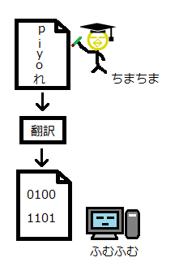

# Fundamental skills of computer science

## コンピュータはどうやってプログラムを認識するか  

人間が書いたプログラムは、もちろんコンピュータは認識しない。  
プログラムで書かれた命令を解釈する部品がCPU。  
CPUは、**機械語(マシン語)**しか解釈できないので、人間が書いたプログラムをコンピュータが解釈するように改変する必要がある。  

 

## プログラミングをコンピュータが認識する仕組み  

人間が書いたプログラムをCPUが解釈できるようにするために、プログラムをマシン語に変換する作業を行う。
この作業を、**コンパイル(ビルド)**と呼び、これを行うツールをコンパイラと呼ぶ。  

 

## 普段目にするアプリケーション  

普段目にするアプリケーションは、誰かが書いたプログラムがマシン語に変換されたものの集合体である。  
これは、１つのファイルとして吐き出され(実行ファイルと呼ぶ)、これが私たちが目にするソフトウェアと呼ばれている。  
