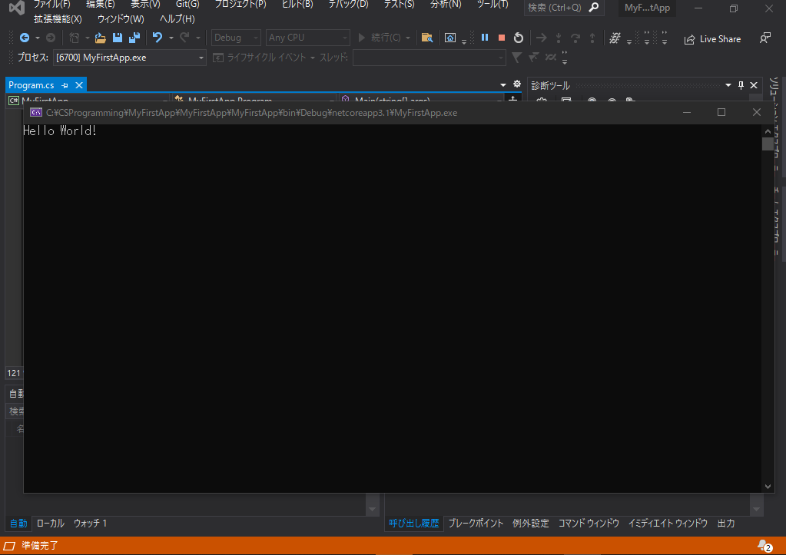

# イントロダクション  

## 基本的なアプリの作成  

VisualStudioで簡単なアプリケーションを作ってみる。  

1. 新規のプロジェクトを作成する。  
プロジェクトとは、ソースコードをIDEで開発できるようにするためにいろいろな設定が必要だが、それら設定をまとめた単位。  
通常、１アプリケーションに１プロジェクト。  

<br>

VisualStudioを起動すると、以下のような画面が表示される。  

  
※テーマを設定していないので色は違うかも  

<br>

2. 新しいプロジェクトを作成する。  

上記のトップ画面右部分から、「新しいプロジェクトの作成(N)」を選択する。  
すると、新しいプロジェクトの作成画面が表示される。
  

新しいプロジェクトの作成画面では、作成するアプリケーションのテンプレートを選択する。  
今回はチュートリアルのため、「コンソールアプリケーション」を選択する。  

  

<br>

3. プロジェクトの構成を決定する。  

アプリケーションのテンプレートを選択したら、新しいプロジェクトの構成画面が表示されるので、それぞれ入力する。  

  

<br>

4. 追加情報  

プロジェクト構成を入力したら、追加情報画面が表示される。  

ターゲットフレームワークを選択する。  
フレームワークとは、C#を動作させる環境のこと。  
特殊な環境の場合以外、VisualStudioがおすすめをデフォルトで設定してくれているので、そのまま選択する。  

  

ここまでで、プロジェクトが作成できる。  

  

作成されたプロジェクトには、すでに最も基本的なプログラムが記述されている。  
これは、プロジェクト作成時に選択したテンプレートによって最も基本的なプログラムをVisualStudioが勝手に生成してくれたもの。 
前回同様、このままではすぐに起動してすぐに終了するアプリケーションができあがるので、VisualStudioが勝手に生成してくれたコードにConsole.ReadLine();の１行を追加する。  

```CSharp
using System;

namespace MyFirstApp
{
    class Program
    {
        static void Main(string[] args)
        {
            Console.WriteLine("Hello World!");
            Console.ReadLine();
        }
    }
}
```  

5. 実行してみる。  

この状態で、画面上部の再生マーク？みたいなボタンをクリックしてみる。  

  

すると、勝手にコマンドプロンプトが立ち上がり、「Hello World」という文字列が表示され、プログラムが実行されていることがわかる。  

  

6. 停止してみる。

アプリケーションが実行されている状態のとき、Visual Studioを見ると、さきほど再生マークだったところが一時停止ボタンと停止ボタンになっている。  

  

この停止ボタンをクリックすると、コマンドプロンプトが勝手に終了する。  
このプログラムの実行が停止されたということ。  

7. Visual Studioに作成されたものを確認する。  

C:\CSProgramming\MyFirstApp(任意)を見ると、その直下にもう１つMyFirstAppがある。  

```
C:\CSProgramming>cd C:\CSProgramming\MyFirstApp

C:\CSProgramming\MyFirstApp>dir
 ドライブ C のボリューム ラベルは Windows です
 ボリューム シリアル番号は 7001-51FD です

 C:\CSProgramming\MyFirstApp のディレクトリ

2021/10/18  22:49    <DIR>          .
2021/10/18  22:49    <DIR>          ..
2021/10/18  22:49    <DIR>          MyFirstApp
               0 個のファイル                   0 バイト
               3 個のディレクトリ  313,310,408,704 バイトの空き領域
```

これは、Visual Studioがプロジェクト作成時に生成したフォルダである。  
この中に、ソースファイルを含むIDEがアプリケーション開発に必要な情報が詰まったファイル達が詰め込まれている。  

<br>

さらにもう１つ進むと、以下のようなものが生成されている。  

```
C:\CSProgramming\MyFirstApp>cd MyFirstApp

C:\CSProgramming\MyFirstApp\MyFirstApp>dir
 ドライブ C のボリューム ラベルは Windows です
 ボリューム シリアル番号は 7001-51FD です

 C:\CSProgramming\MyFirstApp\MyFirstApp のディレクトリ

2021/10/18  22:49    <DIR>          .
2021/10/18  22:49    <DIR>          ..
2021/10/18  22:57    <DIR>          MyFirstApp
2021/10/18  22:49             1,136 MyFirstApp.sln
               1 個のファイル               1,136 バイト
               3 個のディレクトリ  313,308,581,888 バイトの空き領域
```  

*.slnファイルはVisual Studioが管理する最大の単位である。  
VisualStudioは、アプリケーションを構築する際に複数のプロジェクトを組み合わせて構築する場合がある。  
slnファイルは、いくつもの.csprojファイルの管理情報が記載されている。  

さらにMyFirstAppに進んでみる。  

```
C:\CSProgramming\MyFirstApp\MyFirstApp>cd MyFirstApp

C:\CSProgramming\MyFirstApp\MyFirstApp\MyFirstApp>dir
 ドライブ C のボリューム ラベルは Windows です
 ボリューム シリアル番号は 7001-51FD です

 C:\CSProgramming\MyFirstApp\MyFirstApp\MyFirstApp のディレクトリ

2021/10/18  22:57    <DIR>          .
2021/10/18  22:57    <DIR>          ..
2021/10/18  22:49    <DIR>          bin
2021/10/18  22:49               178 MyFirstApp.csproj
2021/10/18  22:49    <DIR>          obj
2021/10/18  22:57               225 Program.cs
               2 個のファイル                 403 バイト
               4 個のディレクトリ  313,302,548,480 バイトの空き領域
```

ここには、上述のcsprojファイルが配置されている。  
今回は単純なアプリケーションなのでcsprojファイルは１個だが、これが複数ある場合がある。  
また、ここには先ほど編集したProgram.csファイルもある。  
Program.csファイルはC#で最初に読まれるプログラムファイルである。  

<br>

次に重要なのは、binフォルダである。  
binフォルダの終点まで進んでみる。  

```
C:\CSProgramming\MyFirstApp\MyFirstApp\MyFirstApp>cd C:\CSProgramming\MyFirstApp\MyFirstApp\MyFirstApp\bin\Debug\netcoreapp3.1

C:\CSProgramming\MyFirstApp\MyFirstApp\MyFirstApp\bin\Debug\netcoreapp3.1>dir
 ドライブ C のボリューム ラベルは Windows です
 ボリューム シリアル番号は 7001-51FD です

 C:\CSProgramming\MyFirstApp\MyFirstApp\MyFirstApp\bin\Debug\netcoreapp3.1 のディレクトリ

2021/10/18  22:57    <DIR>          .
2021/10/18  22:57    <DIR>          ..
2021/10/18  22:57               422 MyFirstApp.deps.json
2021/10/18  22:57             4,608 MyFirstApp.dll
2021/10/18  22:57           174,592 MyFirstApp.exe
2021/10/18  22:57             9,532 MyFirstApp.pdb
2021/10/18  22:57               317 MyFirstApp.runtimeconfig.dev.json
2021/10/18  22:57               154 MyFirstApp.runtimeconfig.json
               6 個のファイル             189,625 バイト
               2 個のディレクトリ  313,305,137,152 バイトの空き領域
```  

ここには、先ほどコンパイルしたときに作成された.exeファイルが存在する。  
ちなみに、binフォルダは初めてのコンパイルを行うまでは生成されておらず、コンパイルされて初めて作られる。  

## デバッグしてみる  

デバッグとは、プログラムのバグを取り除く作業である。  

### ブレークポイントの設置  

ブレークポイントとは、Visual Studioでプログラムの任意の行に設定することで、プログラムがその行に差し掛かったときにアプリケーションを一時停止し、その時のプログラムの状態を確認できる機能である。  

Visual Studioに戻って、Program.csの内容を以下のように書き換える。  

```CSharp
using System;

namespace MyFirstApp
{
    class Program
    {
        static void Main(string[] args)
        {
            Console.WriteLine("あなたの名前は？");
            string name = Console.ReadLine();
            Console.WriteLine($"こんにちは！{name}さん！");
            Console.ReadLine();
        }
    }
}
```  

そして実行。  
  

名前を入力。  

  

Enterキー押下。  

  

改修したプログラムが反映されている事が確認できた。  

では、アプリケーションを停止して、ブレークポイントを設定してみる。  
Visual Studioのプログラムで、Console.WriteLine($"こんにちは！{name}さん！");の行数の左部分をクリックする。  

  

この状態で再度実行する。  
先ほどと同様に、名前を入力してEnterキーを押下。  
すると、強制的にVisual Studioに戻り、指定した行でプログラムが停止している事がわかる。  

  

この状態で、１行上のname部分にマウスオーバーしてみると、nameの値を確認できる。  

  

次に、画面上部の右矢印？のボタンをクリックしてみる。  
これらは、ステップ実行と言って、プログラムを１行ずつ実行できる。  
ここで重要なのは、ステップオーバー実行とステップイン実行である。  
プログラムはこれからするが、ステップオーバー実行は関数の中身までは追わず、ステップイン実行は関数の中まで追っていく。  
とにかく、詳しく見たいときはステップイン実行で良い。  

  

ステップ実行をすると、実行された行を示す矢印が１行進んだことがわかる。  

  

Console.WriteLine($"こんにちは！{name}さん！");が実行されたので、アプリケーションに戻ると、この行が実行された事が確認できる。  

  

