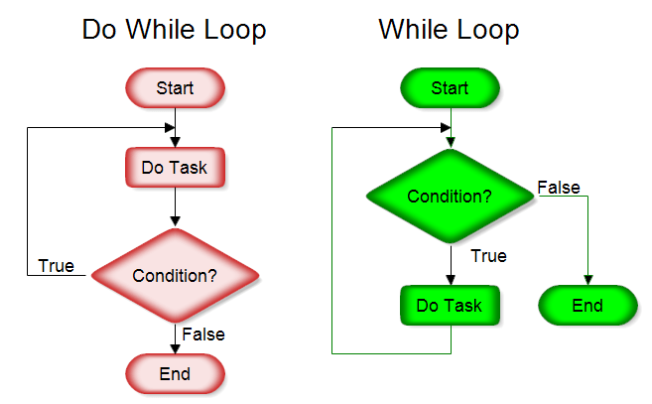

# 制御構文  

一般的に、プログラムの構造は以下のように分類できる。  

- 逐次  
- 条件分岐  
- 繰り返し  

<br>

制御構文では、{}ブロックを使用して、その影響範囲を指定するが、{}内で宣言した変数は直近の{}ブロック内でのみ有効である。  

```CSharp
var data1 = 1;

if(data1 > 0)
{
    var strDisp = "data1 > 0";
    Console.WriteLine(strDisp);
}
else
{
    var strDisp = "data1 <= 0";     // 直近の{}ブロック内でstrDispは宣言されていないので宣言可能
    Console.WriteLine(strDisp);
}
```

<br>

## 条件分岐  

### if命令 - 単純分岐  

ifは与えられた条件が真偽いずれであるかによって実行すべき処理を決める命令。  

```CSharp
if(条件式)
{
    条件式が真の場合の処理
}
else
{
    条件式が偽の場合の処理
}
```  

例：  

```CSharp
var judgeedValue = 10;

if(judgeedValue > 5)
{
    Console.WriteLine("5より大きいです");
}
else
{
    Console.WriteLine("5より小さいです");
}
```  

また、if文のelse以下は省略でき、条件式が真の場合のみ処理を実行する事もできる。  
以下を実行して結果を確認する。  

```CSharp
var judgeedValue = 10;
if(judgeedValue > 5)
{
    Console.WriteLine("5より大きいです");
}

Console.WriteLine(judgeedValue);
```

***テスト***

- 名前と年齢を入力し、「こんにちは、〇〇さん」と表示し、年齢が30歳の場合は、続けて「同い年ですね」と表示するプログラム。
- 整数値を10回入力し、10回の入力値の平均値を表示し、さらに、11回目の入力を促し、その値が平均値以上の場合は「合格」、平均値よりも小さい場合は「不合格」を表示する。  
- 入力値が2の倍数または3の倍数でかつ9の倍数でもある場合は「A」を、それ以外の場合は「B」を表示する。  

<br>

### if命令 - 多岐分岐  

else ifブロックを使用することで、新しい条件式を定義できる。  

例：  

```CSharp
var data = 10;

if(data % 2 == 0)
{
    Console.WriteLine("2の倍数です");
}
else if(data % 3 == 0)
{
    Console.WriteLine("3の倍数です");
}
else
{
    Console.WriteLine("2の倍数でも3の倍数でもありません。");
}
```

***テスト***  

- 入力値が100以下の場合は「A」を、入力値が100より大きく200以下の場合は「B」を、200より大きい場合は「C」を表示するプログラム。

<br>

### if命令の入れ子  

if命令は互いに入れ子にすることもできる。  

```CSharp
if(条件式1)
{
    if(条件式2)
    {
        条件式1が真 かつ 条件式2が真
    }
    else
    {
        条件式1が真 かつ 条件式2が偽
    }
}
else
{
    if(条件式2)
    {
        条件式1が偽 かつ 条件式2が真
    }
    else
    {
        条件式1が偽 かつ 条件式2が偽
    }
 
}
```  

例：以下の実行結果を予測してみる。  

```CSharp
int judgedVal1 = 25;
int judgedVal2 = 31;

if(judgedVal1 > judgedVal2)
{
    if(judgedVal1 >= 100)
    {
        Console.WriteLine("A");
    }
    else
    {
        Console.WriteLine("B");
    }
}
else
{
    if(judgedVal1 >= 100)
    {
        Console.WriteLine("C");
    }
    else
    {
        Console.WriteLine("D");
    }
 
}

```  

***テスト***

- 入力値が100以上の偶数の場合Ａを、100未満の偶数の場合Bを、100以上の奇数の場合Ｃを、100未満の奇数の場合Ｄを表示するプログラム。  

- ユーザ名とパスワードを入力させ、プログラム内で保持した後、再度ユーザ名とパスワードを入力させる。２回目の入力結果でパスワードのみが不正解の場合、「パスワードが間違っています」、ユーザ名のみが不正解の場合、「ユーザ名が間違っています」、両方とも不正解の場合、「そのようなアカウントは存在しません」、両方とも正解の場合、「ログインしました」と表示するプログラム。  

<br>

### switch命令  

switch命令も、if同様条件分岐のための命令文である。  
例えば、以下のコードを見てみる。  

```CSharp
var data = "You";
if(data == "You")
{
    Console.WriteLine("You");
}
else if(data == "Me")
{
    Console.WriteLine("Me");
}
else if(data == "Her")
{
    Console.WriteLine("Her");
}
else
{
    Console.WriteLine("Him");
}
```  

この例では、条件が多くif文でつなげると冗長になり可読性が低いコードになっている。  
このような場合には、switchを利用する。  
switch命令は以下のように記述する。  

```CSharp
switch(条件式)
{
    case 値1:
        条件式 = 値1のときに実行する処理
        break;
    case 値2:
        条件式 = 値2のときに実行する処理
        break;
    case 値3:
        条件式 = 値3のときに実行する処理
        break;
    default:
        すべての条件にあてはまらなかった場合の処理
        break;
}
```  

先ほどの例のプログラムをswitch命令で書くと以下のようになる。  

```CSharp
var data = "You";

switch(data)
{
    case "You":
        Console.WriteLine("You");
        break;
    case "Me":
        Console.WriteLine("Me");
        break;
    case "Her":
        Console.WriteLine("Her");
        break;
    default:
        Console.WriteLine("Him");
        break;
}
```

#### 複数条件にあてはまる処理をswitchで記述する  

```CSharp
var data = "You";

switch(data)
{
    case "You":
    case "Me":
        Console.WriteLine("Us");
        break;
    case "Her":
        Console.WriteLine("Her");
        break;
    default:
        Console.WriteLine("Him");
        break;
}
```

***テスト***  
出身地を「北海道/東京/神奈川/京都/大阪/神戸/福岡/佐賀/香川/愛媛」から選択させ、  
北海道の場合は「北海道」  
東京/神奈川の場合は「関東」  
京都、大阪、神戸の場合は「関西」  
福岡/佐賀の場合は「九州」  
香川/愛媛の場合は「四国」  
それ以外の場合は「国に非ず」  
を表示するプログラム  

<br>

## 繰り返し処理  

<br>

### while/do...while命令  

while/do...while命令は与えられた条件が真である間、配下の処理を繰り返す。  

```CSharp
while(条件式)
{
    条件が真の間、繰り返し実行する処理
}
```  

```CSharp
do
{
    条件が真の間、繰り返し実行する処理
}while(条件式);
```  

  

例:while  

```CSharp
var i = 1;
while( i < 6 )
{
    Console.WriteLine($"{i}番目のループです。");
    i++;
}
/* 実行結果
1番目のループです。
2番目のループです。
3番目のループです。
4番目のループです。
5番目のループです。
*/
```  

例：do while  

```CSharp
var i = 1;
do
{
    Console.WriteLine($"{i}番目のループです。");
    i++;
}while( i < 6 );
/* 実行結果
1番目のループです。
2番目のループです。
3番目のループです。
4番目のループです。
5番目のループです。
*/
```  

上記のプログラムで、iの初期値を6にして実行結果を予測してみる。  

<br>

### 無限ループ  

条件式の部分を以下のようにすると、無限ループになる。  

```CSharp
while(;)
```

または  

```CSharp
while(true)
```  

***テスト***  

- １から１０までを順番に表示するプログラム。

- 以下のクラスの出席番号と名前を表示するプログラム。  
※配列を使用する。  

| 出席番号   |     名前      |
| --- | ----------- |
| 1    | 山田太郎 |
| 2    | 高木次郎 |
| 3    | 鈴木三郎 |
| 4    | 田中花子 |
| 5    | 石田森子 |  

- ユーザ名とパスワードを入力させ、プログラム内で保持した後、いずれかが間違っている場合は再入力を促すプログラム。  

- ユーザ名とパスワードを入力させ、プログラム内で保持した後、いずれかが間違っている場合は再入力を最大3回まで促すプログラム。  

<br>

### for命令  

条件式の真偽に応じて反復処理を行うwhile文に対して、for文による繰り返しはあらかじめ繰り返す回数が決まっている。  

```CSharp
for(初期化子; 条件; 反復子)
{
    ループ内で実行する処理
}
```  

例：  

```CSharp
for(var i = 1; i < 6; i++)
{
    Console.WriteLine($"{i}番目のループです");
}
```  

***テスト***  

- １から１０までを順番に表示するプログラム。

- 以下のクラスの出席番号と名前を表示するプログラム。  
※配列を使用する。  

| 出席番号   |     名前      |
| --- | ----------- |
| 1    | 山田太郎 |
| 2    | 高木次郎 |
| 3    | 鈴木三郎 |
| 4    | 田中花子 |
| 5    | 石田森子 |   

- 1から100を表示するが、3の倍数と3のつく数だけは「あほ」にして表示するプログラム。  
※文字列の中に特定の文字が含まれているかを調べる

```CSharp
string str = "ろうにゃくなんにょ";

    Console.WriteLine(str.Contains("にゃく")); // 出力：True
    Console.WriteLine(str.Contains("にゃん")); // 出力：False
    Console.WriteLine(str.Contains(""));       // 出力：True
```  

<br>

### foreach命令

指定された配列やコレクション(後述)の要素を取り出して順番に処理する。  

```CSharp
foreach(データ型 仮変数 in 配列やコレクション)
{
    個々の要素を処理するためのコード
}
```  

例：  

```CSharp
var datas = new[] {"うめ", "さくら", "もも"};
foreach(var data in datas)
{
    Console.WriteLine(data);
}
/* 実行結果
うめ
さくら
もも
*/
```  

