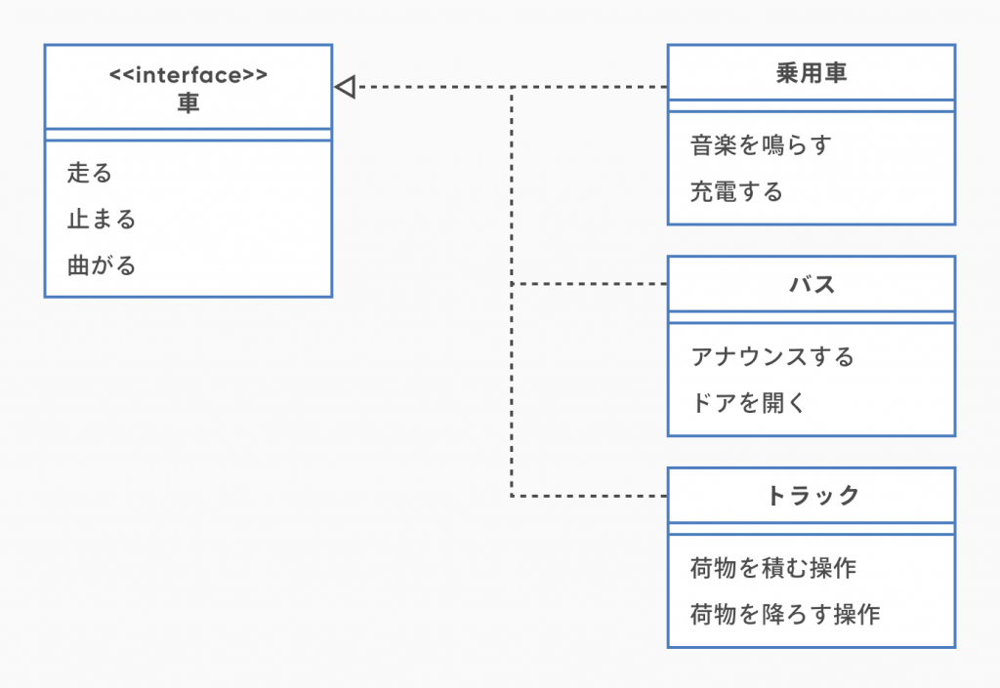
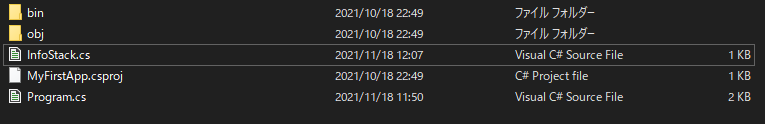
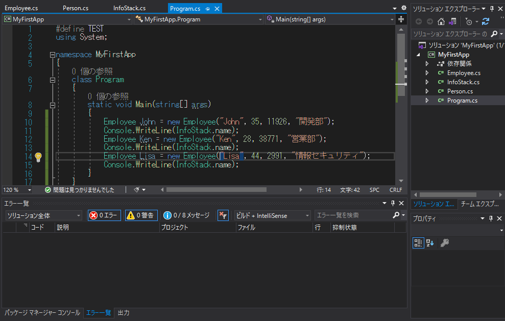
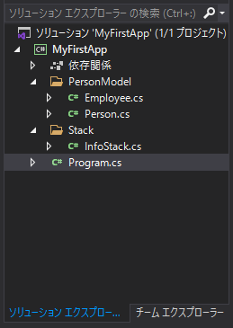

# クラス  

クラスとは、アプリの中である特定の機能を担うかたまりであり、C#のアプリはクラスの集合である。  

<br>

## オブジェクト指向プログラミング  

オブジェクト指向プログラミングとは、機能をクラスにまとめて、クラスの集合体としてアプリケーションを構築していく手法を指す。  
現代で使用されている主なプログラム言語は大体がオブジェクト指向プログラミング言語である。  
例：C#, Java, C++, TypeScript  

逆に機能をまとめずに、単純にソースコードを上から順に実行するプログラム言語はスクリプト型言語と言ったりするが、大体の言語はオブジェクト指向プログラミングもできる仕様になっている。  
例：C, Python, JavaScript  

[オブジェクト指向プログラミング](https://ja.wikipedia.org/wiki/%E3%82%AA%E3%83%96%E3%82%B8%E3%82%A7%E3%82%AF%E3%83%88%E6%8C%87%E5%90%91%E3%83%97%E3%83%AD%E3%82%B0%E3%83%A9%E3%83%9F%E3%83%B3%E3%82%B0)  

<br>

## クラスの定義  

クラスの定義は以下のように記述する。  

```CSharp
[修飾子] class クラス名
{
    クラスの内容
}
```  

例：  

```CSharp
public class Person
{

}
```  

※修飾子は後述  

<br>

### クラス名  

クラス名に対して適切な名前をつけることは、コードの可読性/保守性を保つために重要である。  
クラスの名前は、プログラムだけでなくクラス図などの仕様書内にも登場するので、多数の開発者が目にすることになる。  
クラス図とは、クラス配下のメンバーやクラス同士の関係を表す図のことである。  

  

- Pascal記法で統一  
全ての単語を大文字で始める記法である。String builderクラスを作成したい場合は、StringBuilderと記述する。  

- 対称/機能が明確となるような単語を選定する  

<br>

### 修飾子  

修飾子は、クラスやそのメンバーの性質を決めるキーワードである。  
付与できる修飾子は、クラス、フィールド/メソッドなど、対称となる要素によって異なる。  
以下はクラスに利用できる修飾子である。  

| 修飾子   |     概要      |
| --- | ----------- |
| public    | 全てのクラスからアクセス可能 |
| internal    | 同じアセンブリ内からのみアクセス可能 |
| abstract    | 抽象メンバーを指定 |
| static    | 静的メンバーを指定 |
| sealded    | 他のクラスから継承できない |  

internalの同じアセンブリとは、複数のアプリケーションを連携して使用する場合などに、別のアプリケーションからアクセスできないことを示す。  

abstract、static、sealedについては後述する。  

<br>

### メンバ変数  

クラスの中で宣言される変数を***メンバ変数***という。これは、クラス内で有効な変数となる。  

```CSharp
class Sample{
    int a = 1;
    string str = "test";
}
```

このようなSampleクラスがあるとき、"a"や"str"はメンバ変数となる。  

<br>

### メンバ関数  

メンバ変数同様、クラスないで宣言される関数をメンバ関数という。  

```CSharp
class Sample{
    public void test1(){
        // メソッド内の処理を記述
    }
}
```

***テスト***  
タイヤ、ハンドルという変数と、停止、発車という関数を持つクラスを作成する。  

<br>

### クラスとインスタンス  

クラスを作成したら、そのクラスを利用する必要がある。  
クラスを利用するには、クラスの実体(インスタンス)を作る必要がある。  

```CSharp
クラス名 変数名;    // クラスを格納する変数
変数 = new クラス名();
```  

このように記述することで、インスタンスを生成することができる。  
通常の変数と同じように、宣言と同様に初期化することもできる。  

```CSharp
クラス名 変数名 = new クラス名();
```  

インスタンスからメンバ変数、メンバ関数を利用する際は、以下のように記述する。  

```CSharp
変数名.メンバ名
```  

ここまでの部分のサンプル。  

```CSharp
class Program
{
    static void Main(string[] args)
    {
        Vehicle car = new Vehicle();
        car.Start();
        car.Stop();
    }
}

class Vehicle
{
    int tire;
    private int handle;

    public void Start()
    {
        Console.WriteLine("Start");
    }

    public void Stop()
    {
        Console.WriteLine("Stop");
    }
}
// 実行結果
// Start
// Stop
```  

***メンバのアクセス修飾子***  

[参考](https://itsakura.com/csharp-access-modifiers)  

覚えておくのは２つ。  
***private***：そのクラス内からのみアクセス可能。  
***public***：別のクラスからアクセス可能。  
***修飾子を省略した場合***：private扱い。  

上記のサンプルでは、```public```が付いている```Start()```と```Stop()```には、別のクラスからアクセスできるが、何もついていない```tire```と```private```が付いている```handle```は外部クラスからアクセスできない。  

```CSharp
Vehicle car = new Vehicle();
car.Start();        // OK
car.Stop();         // OK
int tireNum = car.tire;     // NG コンパイルエラー
car.tire = 4;               // NG コンパイルエラー
int handleNum = car.handle; // NG コンパイルエラー
car.handle = 1;             // NG コンパイルエラー
```  

***テスト***  

以下のクラスを利用して、自転車クラスと自動車クラスを作成する。  
このとき、タイヤの数と名前を代入し、ShowDetail関数を実行する。  

```CSharp
class Vehicle
{
    private int handle = 1;
    public int tire;
    public string name;

    public void ShowDetail()
    {
        Console.WriteLine($"名前：{name}");
        Console.WriteLine($"タイヤの数：{tire}");
        Console.WriteLine($"ハンドルの数：{handle}");

    }

    public void Start()
    {
        Console.WriteLine("発車します");
    }

    public void Stop()
    {
        Console.WriteLine("停車します");
    }
}
/* 実行結果
名前：自動車
タイヤの数：4
ハンドルの数：1
名前：自転車
タイヤの数：2
ハンドルの数：1
*/
```  

<br>  

### コンストラクタ

クラスのインスタンス生成自にクラス内の初期化処理を行う事ができる。  

```CSharp
public クラス名(引数)
{
    コンストラクタで行う処理
}
```  

例えば、上記の```Vehicle```クラスは```ShowDetail```を実行する際は、```tire```と```name```が事前に設定されている前提となる。  
そのため、```tire```と```name```を設定する前に```ShowDetail```を実行すると、意図しない動作となる場合がある。  
そこで、```Vehicle```クラスのコンストラクタを使って、```tire```と```name```を必ず設定するようにしてみる。  

```CSharp
class Vehicle
{
    public Vehicle(string nameIn, int tireIn)
    {
        name = nameIn;
        tire = tireIn;
    }
}
```

コンストラクタは、クラスのインスタンスを生成するタイミングで実行される。  

```CSharp
Sample class = new Sample();
```  

の```Sample()```の部分は、実はコンストラクタが呼び出されている。  
つまり、先ほど作成したコンストラクタによって```Vehicle```クラスのインスタンスを生成する時には、必ずnameとtireを設定する必要がある。  

```CSharp
Vehicle car = new Vehicle("自動車", 4);
```  

こうすることで、インスタンス生成時に必ず```tire```と```name```が設定されることが保証されるので、安全に```ShowDetail```を実行できるようになる。  

***補足***  
C#のプログラムで```this```というワードを見かけた場合、それは自分自身のインスタンスを示すものである。  

```CSharp
public Sample(int r){ 
            this.r = r; 
        }
```  

引数のrと、自クラスのメンバ変数を見分けるためにthisを用いるケースが多い。  

<br>

## 継承  

継承とは、あるクラスの機能を受け継いで新しいクラスを作る事。  

```CSharp
class クラス名: 継承したいクラス名
{
    // クラスの内容
}
```  

例えば、以下のような```Person```があったとする。  

```CSharp
class Person
{
    string name;
    int age;
    public Person(string name, int age)
    {
        this.name = name;
        this.age = age;
    }

    public void SelfIntroduction()
    {
        Console.WriteLine($"こんにちは、私の名前は{name}です。{age}歳です。");
    }
}
```  

さらに、以下のような従業員クラスを作成する。  

```CSharp
class Employee
{
    string name;
    int age;
    int id;
    string department;

    public Employee(string name, int age, int id, string department)
    {
        this.name = name;
        this.age = age;
        this.id = id;
        this.department = department;
    }

    public void SelfIntroduction()
    {
        Console.WriteLine($"こんにちは、私の名前は{name}です。{age}歳です。");
    }

    public void CompanyIntroduction()
    {
        Console.WriteLine($"社員番号：{id}、部署：{department}");
    }
}
```  

この、```Employee```クラスの```name```、```age```、```SelfIntroduction```は、```Person```クラスが全て持っているため、もう一度定義するのは冗長である。  
そこで、```Employee```クラスに```Person```を***継承***させることで、冗長な部分を省略できる。  

```CSharp
class Employee: Person
{
    int id;
    string department;

    public Employee(string name, int age, int id, string department) : base(name, age)
    {
        this.id = id;
        this.department = department;
    }

    public void CompanyIntroduction()
    {
        Console.WriteLine($"社員番号：{id}、部署：{department}");
    }
}
```  

継承しているクラスがあるときの、コンストラクタは  
```CSharp
public クラス名(引数) : base(引数)
{
    コンストラクタの処理
}
```  

のように記述する。  

この、```Employee```クラスを使用する場合、```Employee```クラスのインスタンスを生成するだけで、継承元の```Person```クラスのメンバも使えるようになる。  

```CSharp
Employee employee = new Employee("John", 35, 11926, "開発部");

employee.SelfIntroduction();
employee.CompanyIntroduction();
```  

***テスト***  
Personクラスを継承して、学籍番号と学年を持つ「学生」クラスを作成する。  
学生クラスは、学籍番号と学年を表示する関数も用意する。  
学生クラスを利用する際は、自己紹介をした後に、学籍番号と学年を表示する。  

<br>  

## 静的(static)クラス  

これまでのクラスは、インスタンスを生成することで(newすることで)初めて、そのクラスのメンバにアクセスすることができた。  
しかし、クラスの中には、インスタンスを生成しなくても使用できるクラスがある。  

```CSharp
static class StaticClass
{
    public string data = "スタティッククラス";
}
```  

```CSharp
Console.WriteLine(StaticClass.data);
// 実行結果：スタティッククラス
```  

これは、汎用的な機能を有しており機能の範囲を特定できないケース(Consoleクラスや、Int32クラスなど)や、アプリ内でデータを共有したい場合などに用いられる。  

アプリ全体で最後に生成された「従業員」クラスの情報を上書き保存しておくクラスを作成する。  

```CSharp
static class InfoStack
{
    public static int id;
    public static string name;
    public static int age;
}
```  

```Employee```クラスのコンストラクタにて、指定されたid, name, ageを```InfoStack```クラスに保存するように改造する。  

```CSharp
public Employee(string name, int age, int id, string department) : base(name, age)
{
    this.id = id;
    this.department = department;

    InfoStack.name = name;
    InfoStack.id = id;
    InfoStack.age = age;
}
```

```Employee```クラスのインスタンスを複数生成しても、staticクラスである```InfoStack```クラスの情報は保持される。  

```CSharp
Employee John = new Employee("John", 35, 11926, "開発部");
Console.WriteLine(InfoStack.name);
Employee Ken = new Employee("Ken", 28, 38771, "営業部");
Console.WriteLine(InfoStack.name);
Employee Lisa = new Employee("Lisa", 44, 2991, "情報セキュリティ");
Console.WriteLine(InfoStack.name);
/* 実行結果
John
Ken
Lisa
*/
```  

***テスト***  
ユーザ名とパスワードが保存されるUserInfoクラスを作成し、ユーザ認証プログラムを作成する。  

1. ユーザ名とパスワードを入力させる。  
2. 入力された情報をUserInfoクラスに保存する。  
3. 再度ユーザ名とパスワードを入力させる。  
4. 再入力されたユーザ名とパスワードをUserInfoに保存されている情報と比べていずれかが間違っている場合、「間違っています」を、両方合っている場合「ログインしました」を表示する。  

<br>

## クラスのファイル分離とnamespace  

これまで学んだクラスの記述は全て同じファイル内に存在しており、プログラム規模が大きい場合に、同じファイルに多数のクラスが記述されていれば、見つけにくく煩雑なプログラムになってしまう。  
そこで、クラスを別ファイルに記述することで、プログラムを簡潔に記述することができる。  

```CSharp
namespace MyFirstApp
{
    class Program
    {
        static void Main(string[] args)
        {
            // 処理省略
        }
    }

    static class InfoStack
    {
        // 処理省略
    }

    class Person
    {
        // 処理省略
    }

    class Employee : Person
    {
        // 処理省略
    }
}
```  

Program.csファイルがあるところに、新しくInfoStack.csファイルを作成する。  

  

Program.csファイル内に記述されているInfoStackクラスをInfoStack.csファイルに移植する。(Program.csファイル内のInfoStackクラスは削除する)  

InfoStack.cs

```CSharp
namespace MyFirstApp
{
    static class InfoStack
    {
        public static int id;
        public static string name;
        public static int age;
    }

}
```  

Program.cs  

```CSharp
using System;

namespace MyFirstApp
{
    class Program
    {
        static void Main(string[] args)
        {
            Employee John = new Employee("John", 35, 11926, "開発部");
            Console.WriteLine(InfoStack.name);
            Employee Ken = new Employee("Ken", 28, 38771, "営業部");
            Console.WriteLine(InfoStack.name);
            Employee Lisa = new Employee("Lisa", 44, 2991, "情報セキュリティ");
            Console.WriteLine(InfoStack.name);
        }
    }

    class Person
    {
        string name;
        int age;
        public Person(string name, int age)
        {
            this.name = name;
            this.age = age;
        }

        public void SelfIntroduction()
        {
            Console.WriteLine($"こんにちは、私の名前は{name}です。{age}歳です。");
        }
    }


    class Employee : Person
    {
        int id;
        string department;

        public Employee(string name, int age, int id, string department) : base(name, age)
        {
            this.id = id;
            this.department = department;

            InfoStack.name = name;
            InfoStack.id = id;
            InfoStack.age = age;
        }

        public void CompanyIntroduction()
        {
            Console.WriteLine($"社員番号：{id}、部署：{department}");
        }
    }
}

```  

こうすることで、Program.cs内の記述は少し簡潔になる。  

***テスト***  
Program.cs内の他のクラスに関しても同様に別ファイルに記述する。 
※EmployeeとPersonファイルの先頭には、```using System;```を記述する。(詳細は後述する)  

<br>

こうなってくると、全てのファイルが同じフォルダ内にあることで、ソリューションエクスプローラーが見にくくなってくる。  

  

そこで、ファイルを格納するフォルダ構成を整備する。  
以下のような構成にしたい。  

```CSharp
C:.
│  MyFirstApp.csproj
│  Program.cs
│
├─bin
├─obj
├─PersonModel
│      Employee.cs
│      Person.cs
│
└─Stack
        InfoStack.cs
```  

①VisualStudioのソリューションエクスプローラーからプロジェクトを右クリック。  
②「追加」/「新しいフォルダー」を選択し、PersonModelフォルダを作成する。  
③作成されたフォルダーをさらに右クリック。  
④「追加」/「新しい項目」を選択する。  
⑤新しい項目の設定画面が表示されるので、「クラス」を選択しファイル名をEmployee.csにして「追加」ボタンをクリックする。  
⑥VisualStudioが自動で新しいクラスを生成してくれる。  

```CSharp
using System;
using System.Collections.Generic;
using System.Text;

namespace MyFirstApp.PersonModel
{
    class Employee
    {
    }
}
```  

⑦Employeeクラスの中身を元あった内容に変更する。  
③～⑦の手順をPersonクラスにも適用する。  
また、①～⑦の手順で、StackフォルダのInfoStack.csファイルも生成する。  

  

Prgram.csに戻ると、EmployeeクラスとInfoStackクラスを使っているところがエラーになっていることがわかる。  
これは、それぞれのクラスの***namespace***が違うことによって生じているエラーである。  
namespaceは、クラスの持ち主を示している。メンバ変数の持ち主がクラスであるように、クラスも持ち主があり、それがnamespaceである。  
namespaceは、クラスの上位に以下のように記述する。  

```CSharp
namespace ネームスペース名
{
    class クラス名
    {
    }
}
```

通常、ネームスペース名は、```namespace MyFirstApp.PersonModel```のようにアプリ名.ネームスペース名と記述することが多い。  

***テスト***  
各クラスのnamespaceを答える。  

<br>

### using  

namespaceの違いにより、別ファイルを参照できなくなってしまっているエラーを解消するには```using```キーワードで参照したいネームスペースを記述する。  
各.csファイルには、先頭に```using xxxx;```という記述がある。  
ここで指定したnamespaceは、そのファイル内で参照可能となる。  

***テスト***  
Prgram.csで発生しているエラーを解消する。  
