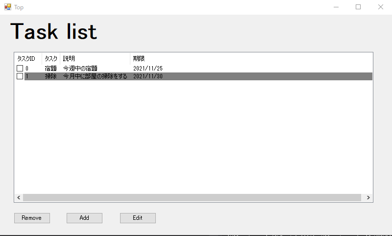
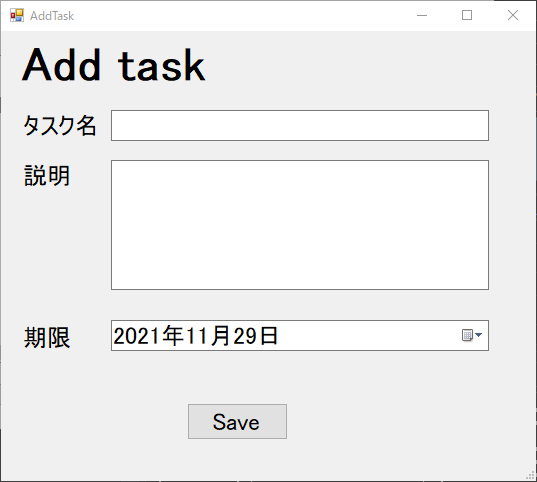

# タスク管理アプリを作る  

## 要件定義  

タスク名、概要、期限、完了フラグをトップページでリスト表示する。  
そのうち、完了タスクは背景色をグレイアウトする。  
これらのタスクは、削除、追加、編集が可能で、タスクリストの各行にはチェックボックスを設け、複数タスクの一括削除を可能とする。  

## 画面仕様  

 

### TOP画面  

TOP画面ではタスクID、タスク名、説明、期限が確認できるタスク一覧を表示する。  
また、タスクは削除、追加、編集ができ、チェックボックスを複数選択することで複数タスクの一括削除が可能である。  

  

 

### タスク追加画面  

タスク追加画面は、タスク名、説明、期限を入力し、「Save」ボタンをクリックした時点でタスク追加画面を終了し、タスク一覧画面に反映する。  

  

